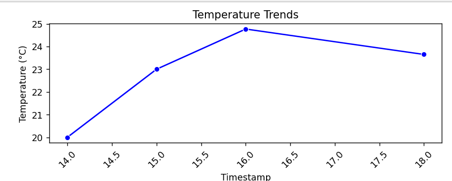
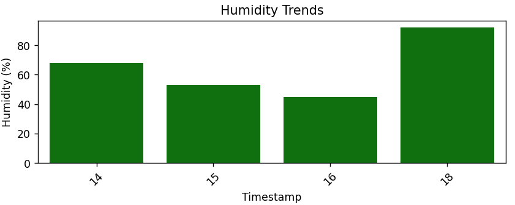
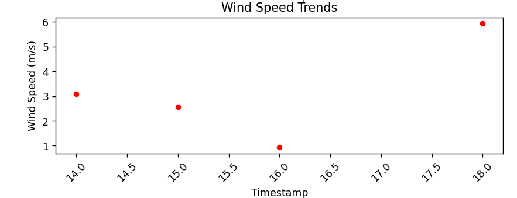
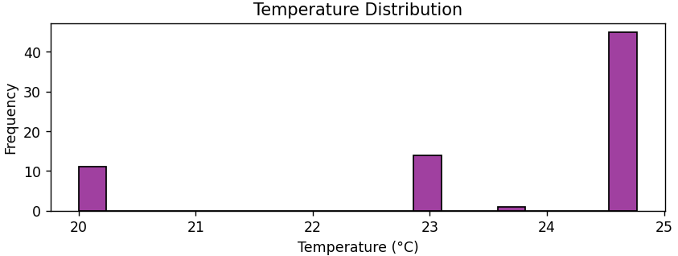
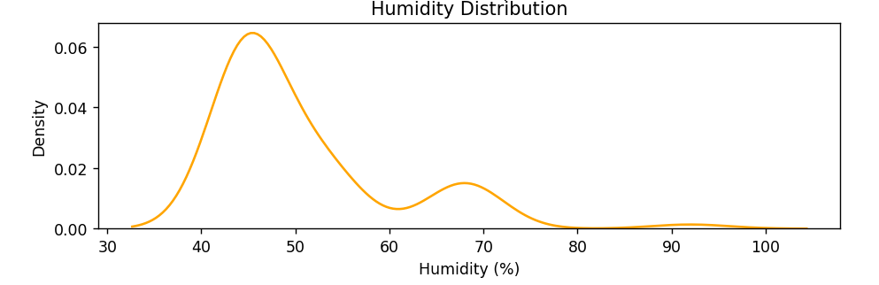
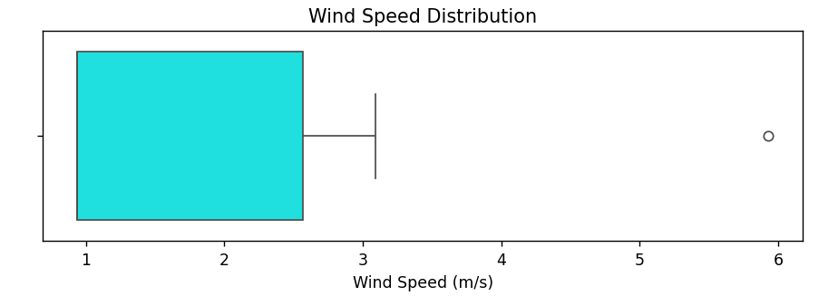

# Weather Data Analysis and Visualization

This project collects weather data from the OpenWeatherMap API, stores it in a SQLite database, and then performs analysis and visualization on the collected data. The project consists of three main scripts:

1. **`main.py`**: Fetches weather data from the API and stores it in a SQLite database.
2. **`data_analyze.py`**: Fetches data from the database and performs basic statistical analysis.
3. **`graphical_visualizations.py`**: Creates various visualizations of the weather data using Matplotlib and Seaborn.

### Required Specifications

- Python 3.x
- Required Python packages:
  - `requests`
  - `sqlite3` (comes with Python standard library)
  - `pandas`
  - `matplotlib`
  - `seaborn`

### Setup
  1. Store all the files in single folder.
  2. Run the main.py
  3. Then analyze_data.py to analyze the data you fetched
  4. next you will be able visualize the data only if you have ran the analyze_data.py

### Output
1. Temperature Trends

This line plot shows the changes in temperature over time. It helps in identifying patterns and trends in temperature throughout the day. By observing the peaks and troughs, we can determine the warmest and coolest times of the day.
</img>

2. Humidity Trends

This bar plot illustrates the variations in humidity levels over time. It provides insights into how humidity fluctuates, which can be crucial for understanding weather patterns and planning activities accordingly.
</img>

3. Wind Speed Trends

This scatter plot displays the wind speed at different times of the day. It helps in understanding how wind speed changes throughout the day, which can be useful for activities dependent on wind conditions, such as sailing or flying.
</img>

4. Temperature Distribution

This histogram shows the distribution of temperature readings. It helps in understanding the frequency of different temperature ranges and identifying the most common temperature levels experienced during the data collection period.
</img>

5. Humidity Distribution

This KDE (Kernel Density Estimate) plot visualizes the distribution of humidity levels. It provides a smooth estimate of the probability density function of humidity, highlighting the most probable humidity levels.
</img>

6. Wind Speed Distribution

This box plot represents the distribution of wind speed readings. It shows the range, median, and any potential outliers in the wind speed data, offering a comprehensive view of the wind speed variations.
</img>

### Created by Rohit Shinde (rohitshinde3903@gmail.com) with some help of ChatGpt

